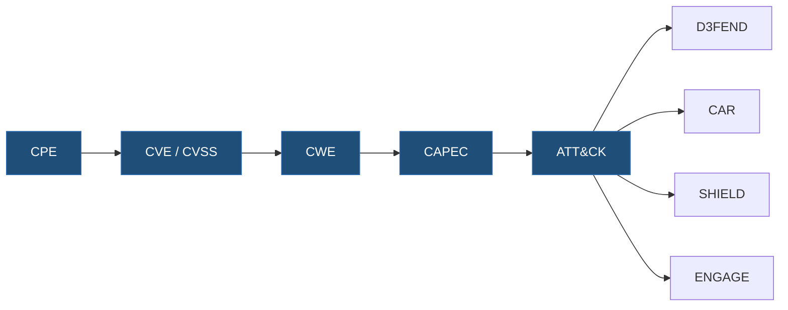

# kgcs-spec

The **KGCS standard**: the single source of truth for semantics and contracts. Every other repo in the [Ariadna-KGCS organization](https://github.com/Ariadna-KGCS) pins a released version of this repo.

**KGCS** (Knowledge Graph for CyberSecurity) is a deterministic grounding layer that lets AI systems reason about cybersecurity without hallucination. Agents answer by following an explicit causal chain through the knowledge graph — `CPE → CVE/CVSS → CWE → CAPEC → ATT&CK → {D3FEND, CAR, SHIELD, ENGAGE}` — never by guessing.

## The causal chain



Every standard module, SHACL shape and contract in this repo exists to make this chain
traversable and enforceable — no shortcut edges, no merged identifiers, full provenance
per hop.

## Layout

- `ontology/core/` — core OWL ontology (v1.0, **frozen**)
- `ontology/standards/` — per-standard OWL modules: CPE, CVE, CVSS, CWE, CAPEC, ATT&CK, D3FEND, CAR, SHIELD, ENGAGE (v1.0, **frozen**), plus versioned modules scoped to one standard (`cwe-enrichment`, `cwe-consequences`, `capec-consequences`, `cve-applicability`, `cve-weakness-provenance`)
- `ontology/extensions/` — versioned cross-cutting modules: asset extension (v1.0, frozen), ATT&CK–core alignment, graph labels, build metadata
- `shapes/` — SHACL shapes per standard + rule-engine spec
- `mappings/` — standard→OWL mapping docs + coverage matrix
- `contracts/` — machine-readable contracts (JSON Schema): graph schema for agents, request/response envelopes
- `docs/` — namespace policy, model documentation, glossary, ADRs
- `tests/` — validation harness (`python -m pytest`): parse, meta-SHACL, OWL↔SHACL alignment, JSON Schema, ABox fixtures with negative cases

## Rules

- Frozen v1.0 artifacts are never modified; successors are new versioned files.
- Module location: a versioned module scoped to one standard lives in `ontology/standards/<std>-<module>-vX.Y.owl` and declares its terms in that standard's namespace; a cross-cutting module lives in `ontology/extensions/`. Frozen files are never moved.
- The causal chain `CPE → CVE/CVSS → CWE → CAPEC → ATT&CK → {D3FEND, CAR, SHIELD, ENGAGE}` is part of the standard: no shortcut edges.
- Every change ships as a tagged release with a CHANGELOG entry; consumers (`kgcs-pipeline`, `kgcs-server`) upgrade by moving their pin.

## Status

**v1.1.0** (2026-09-26) — first minor release on top of the frozen v1.0 baseline. It adds versioned modules (CWE enrichment, consequences, CVE applicability, CAUSED_BY provenance, graph labels, ATT&CK–core alignment, build metadata), the validation harness, and the 2026-09-26 graph-quality fixes. See `CHANGELOG.md`. **v1.0.0**: the frozen KGCS v1.0 baseline, migrated verbatim from the seed repo (OWL byte-identical).

## Validation

```bash
pip install -r requirements-dev.txt
python -m pytest
```

The harness fails on any file that parses to zero triples, on any shape reference that no OWL module declares, and on any fixture individual that does not conform. The inference mode is fixed (`tests/conftest.py`, `INFERENCE_MODE`).

## License

[Apache 2.0](LICENSE). CPE, CVE, CVSS, CWE, CAPEC, ATT&CK, D3FEND, CAR, SHIELD and ENGAGE remain the property of their respective owners (NIST, MITRE); this repo only models their semantics and preserves source-specific provenance.
